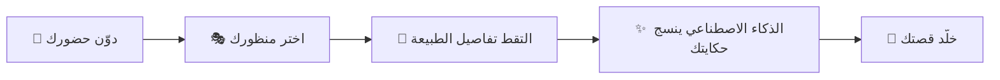

# 🌾 مِحكاة | MHKAH

<div align="center">


### **تجربة تُحيي حكايات الأرض بعيون الابتكار**
### *Breathing Life into the Land's Untold Stories*

[](https://reactjs.org/)
[](https://www.typescriptlang.org/)
[](https://www.framer.com/motion/)
[](https://vitejs.dev/)
[](https://www.vision2030.gov.sa/)

[🌐 **Live Demo**](https://mhkah.netlify.app) | [📧 **Contact**](mailto:ahmedrasheed121m@gmail.com)

---

</div>

## 📖 نبذة عن المشروع | About

**مِحكاة** هي منصة سياحية زراعية تفاعلية ذكية تجمع بين التراث السعودي الأصيل والتقنيات الحديثة، حيث تحوّل الزيارات التقليدية إلى مزارع الحمضيات السعودية إلى تجارب غامرة فريدة من نوعها.

**MHKAH** is an innovative agritourism platform that merges authentic Saudi heritage with cutting-edge technology, transforming traditional visits to Saudi citrus farms into immersive, personalized storytelling experiences.

### 🎯 الرؤية | Vision

> **إيقاظ العملاق النائم في السياحة الزراعية**  
> نلتزم بريادة التحول في قطاع السياحة الريفية بما يتماشى مع **رؤية السعودية 2030**، محولين المزارع التقليدية إلى وجهات ثقافية واقتصادية نابضة بالحياة عبر دمج التقنية العميقة بالإرث الطبيعي.

---

## ✨ المميزات الرئيسية | Key Features

<table>
<tr>
<td width="50%">

### 🤖 **الذكاء الاصطناعي التفاعلي**
- وكيل AI متطور ينسج قصصًا فريدة
- تخصيص التجربة حسب نوع الزائر
- تحليل البيانات المكانية والتفاعلية

</td>
<td width="50%">

### 🌿 **تجربة غامرة**
- واقع معزز في قلب المزرعة
- قصص شخصية لكل زائر
- ذاكرة دائمة للزيارات المتكررة

</td>
</tr>
<tr>
<td width="50%">

### 🎭 **ثلاثة أنماط زيارة**
1. **مستكشف صغير** - للأطفال
2. **عائلة** - تجربة عائلية
3. **سائح عالمي** - للسياح الدوليين

</td>
<td width="50%">

### 📖 **أرشيف القصص**
- حفظ جميع الحكايات السابقة
- إكمال القصة في الزيارات القادمة
- مشاركة التجربة مع الآخرين

</td>
</tr>
</table>

---

## 🛠️ التقنيات المستخدمة | Tech Stack

### Frontend Framework
```typescript
- React 19.2.3 (أحدث إصدار)
- TypeScript 5.8.2
- Vite 6.2.0 (للبناء السريع)
```

### UI & Animation
```typescript
- Framer Motion 12.23.26 (للرسوم المتحركة الانسيابية)
- Tailwind CSS (للتصميم الحديث)
- Custom Design System (نظام تصميم مخصص)
```

### Architecture
```
├── React Components (مكونات معيارية)
├── TypeScript (للكتابة الآمنة)
├── Custom Hooks (خطافات مخصصة)
└── State Management (إدارة الحالة)
```

---

## 🚀 كيفية التشغيل | Installation & Setup

### المتطلبات | Prerequisites
```bash
- Node.js (v18 أو أحدث)
- npm أو yarn
```

### 1️⃣ استنساخ المشروع | Clone Repository
```bash
git clone https://github.com/Ahmed-1425/MHKAH.git
cd MHKAH
```

### 2️⃣ تثبيت الحزم | Install Dependencies
```bash
npm install
# أو
yarn install
```

### 3️⃣ تشغيل المشروع | Run Development Server
```bash
npm run dev
# أو
yarn dev
```

سيعمل المشروع على: `http://localhost:5173`

### 4️⃣ بناء المشروع | Build for Production
```bash
npm run build
# أو
yarn build
```

---

## 📂 هيكل المشروع | Project Structure

```
mhkah/
│
├── 📁 components/           # المكونات الرئيسية
│   ├── Hero.tsx            # الصفحة الرئيسية
│   ├── About.tsx           # نبذة عن المشروع
│   ├── HowItWorks.tsx      # آلية العمل
│   ├── Vision.tsx          # الرؤية والأهداف
│   ├── StoryDemo.tsx       # محاكاة القصص
│   ├── Founders.tsx        # نبذة عن المؤسسين
│   ├── Footer.tsx          # التذييل
│   ├── Layout.tsx          # التخطيط العام
│   └── Splash.tsx          # شاشة البداية
│
├── 📄 constants.ts         # الترجمات والثوابت
├── 📄 types.ts            # تعريفات TypeScript
├── 📄 App.tsx             # المكون الرئيسي
├── 📄 index.tsx           # نقطة البداية
├── 📄 metadata.json       # البيانات الوصفية
├── 📄 tailwind.config.js  # إعدادات Tailwind
├── 📄 vite.config.ts      # إعدادات Vite
└── 📄 package.json        # التبعيات والنصوص
```

---

## 🎨 نظام الألوان | Color Palette

```css
/* الألوان المخصصة للمشروع */
--mhkah-dark: #1A3A1A      /* الأخضر الداكن */
--mhkah-deep: #2C5530      /* الأخضر العميق */
--mhkah-olive: #556B2F     /* الزيتوني */
--mhkah-sand: #C19A6B      /* الرملي */
--mhkah-offwhite: #F5F5DC  /* الأوف وايت */
```

---

## 🎭 آلية العمل | How It Works



1. **التسجيل** - دوّن حضورك في المزرعة
2. **اختيار النمط** - اختر منظورك (طفل / عائلة / سائح)
3. **التقاط اللحظات** - التقط تفاصيل الطبيعة حولك
4. **السحر الرقمي** - دع الذكاء الاصطناعي ينسج حكايتك الفريدة
5. **الذاكرة الدائمة** - خلّد قصتك للزيارات القادمة

---

## 👥 المؤسسون | Founders

<table>
<tr>
<td align="center" width="50%">

<br />
<h3><b>أحمد بن خالد الرشيد</b></h3>
<p><b>Ahmed Khalid Alrasheed</b></p>
<p>
مهندس ذكاء اصطناعي | مطور iOS | مطور برمجيات<br/>
<i>AI Engineer | iOS Developer | Full-stack Developer</i>
</p>

🏆 **الإنجازات:**
- 🥇 المركز الأول - هاكاثون المبادرات الشبابية
- 🥈 المركز الثاني - Qualithon
- 🥈 المركز الثاني - مسابقة قروش لريادة الأعمال 2025
- 🥇 المركز الأول - المنتدى العلمي الجامعي (2023 و2025)

📧 [البطاقة الرقمية](https://ahmedk-digital-card.netlify.app/)

</td>
<td align="center" width="50%">

<br />
<h3><b>أميرة بنت خالد الدعجاني</b></h3>
<p><b>Amirah Khalid Aldajani</b></p>
<p>
مختصة ذكاء اصطناعي | محللة بيانات | مطورة IoT<br/>
<i>AI Specialist | Data Analyst | IoT Developer</i>
</p>

🏆 **الإنجازات:**
- 🥈 المركز الثاني - مسابقة قروش لريادة الأعمال 2025
- 🤖 مشاريع ترجمة لغة الإشارة الذكية
- 🌾 مشاريع الزراعة الذكية (AI + IoT)
- 📊 خبرة في تحليل البيانات و RPA

📧 [البطاقة الرقمية](https://amirahk-digital-card.netlify.app/)

</td>
</tr>
</table>

---

## 🌍 التوافق مع رؤية 2030 | Aligned with Vision 2030

<div align="center">

### 🎯 الأهداف الاستراتيجية | Strategic Goals

| الهدف | التأثير |
|:---:|:---:|
| 🌾 **تنويع الاقتصاد** | تحويل المزارع إلى وجهات سياحية |
| 🏞️ **تطوير السياحة** | سياحة زراعية مبتكرة ومستدامة |
| 🤖 **التحول الرقمي** | دمج التقنيات الحديثة بالتراث |
| 🇸🇦 **الإرث الثقافي** | إحياء التراث الزراعي السعودي |
| 💼 **خلق الفرص** | فرص عمل في السياحة والتقنية |

</div>

---


## 🤝 المساهمة | Contributing

نرحب بالمساهمات من الجميع! إذا كنت ترغب في المساهمة:

1. Fork المشروع
2. أنشئ فرعًا للميزة الجديدة (`git checkout -b feature/AmazingFeature`)
3. Commit التغييرات (`git commit -m 'Add some AmazingFeature'`)
4. Push للفرع (`git push origin feature/AmazingFeature`)
5. افتح Pull Request

---


## 🙏 شكر وتقدير | Acknowledgments

- شكرًا لرؤية المملكة 2030 للإلهام

---

<div align="center">

### 🌟 صُنع بـ ❤️ في المملكة العربية السعودية
### *Made with ❤️ in Saudi Arabia*

**© 2025 MHKAH | مِحكاة - All Rights Reserved**

[](https://www.vision2030.gov.sa/)

---

إذا أعجبك المشروع، لا تنسَ إضافة ⭐️  
*If you like this project, don't forget to give it a ⭐️*

</div>
